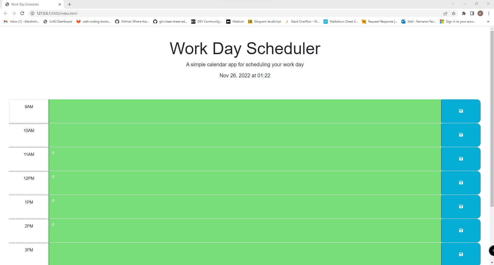

# Time Wise daily planner

## Description
 
The website is a daily planner. The page will display the current date and time at the top of the page. The business hours will change colors depending on the time of day. If the hour is in the future it will be green. When the hour is past it will be gray. When it is the current hour it will be red. You can add your daily plans in each section such as meetings or events and save them. After the save the plans will stay even if the page is refreshed. 

## Installation
 
All files and folders will be needed for the application to run. 

## Usage
https://kfarshchian.github.io/time-wise/

## Credits

The starter code was provided by Georgeyoo

## License

Please refer to the LICENSE in the repo.
